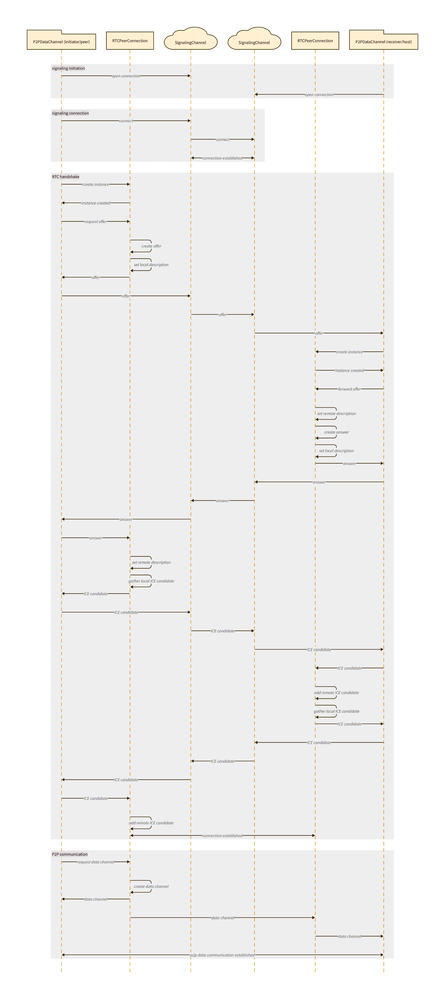

[](https://dl.circleci.com/status-badge/redirect/gh/brennervaz/p2p-data-channel/tree/main)

# p2p-data-channel

`p2p-data-channel` is a TypeScript library that simplifies the process of creating a peer-to-peer (P2P) data channel using WebRTC for the main data channel and PeerJS as a signaling channel. With this library, developers can easily add peer-to-peer communication to their web applications without having to worry about the underlying details of WebRTC or PeerJS.

## Installation


```sh
npm install p2p-data-channel
```

## Usage

```typescript
import P2PDataChannel from 'p2p-data-channel'

// default config values
const config = {
  debug: false, // output every method call to console
  dataChannel: 'default', // name of the data channel to be open
  connectionTimeout: 5000, // timeout to consider connection failure on init
  pingInterval: 4000, // interval for each ping/pong
  pingTimeout: 8000, // timeout to consider disconnection on ping/pong
}

const dataChannel = new P2PDataChannel('your-peer-id', config) // config is optional

// Receive a message
dataChannel.onMessage((message) => {
  console.log(`Received message from ${message.sender}: ${message.payload}`)
})

// Connect to a peer
dataChannel.connect('peer-id-to-connect').then(() => {
  // Send a message
  dataChannel.send('peer-id-to-connect', 'Hello, world!')
})

// Disconnect from the peer
dataChannel.disconnect('peer-id-to-disconnect')
```

## API

### `connect(remotePeerId: PeerId): Promise<void>`

Connects to the peer identified by remotePeerId.

Example:

```typescript
dataChannel.connect('remote-peer-id')
  .then(() => {
    console.log('Connected to remote peer')
  })
  .catch((err) => {
    console.error(`Error connecting to remote peer: ${err}`)
  })
```

### `disconnect(remotePeerId: PeerId): void`

Disconnects from the peer identified by remotePeerId.

Example:

```typescript
dataChannel.disconnect('remote-peer-id')
```

### `onMessage(callback: P2PChannelMessageCallback<IMessagePayload>): void`

Registers a callback to be called when a message is received from any peer.

Example:

```typescript
dataChannel.onMessage((message) => {
  console.log(`Received message from ${message.sender}: ${message.payload}`);
})
```

### `onConnected(callback: (remotePeerId: PeerId) => void): void`

Registers a callback to be called when a peer is connected.

Example:

```typescript
dataChannel.onConnected((remotePeerId) => {
  console.log(`${remotePeerId} is connected!`);
})
```

### `onDisconnected(callback: (remotePeerId: PeerId) => void): void`

Registers a callback to be called when a peer is disconnected.

Example:

```typescript
dataChannel.onDisconnected((remotePeerId) => {
  console.log(`${remotePeerId} disconnected!`);
})
```

### `send(remotePeerId: PeerId, payload: IMessagePayload): void`

Sends a message to the peer identified by remotePeerId.

`throws` ConnectionNotEstablished if not connected

Example:

```typescript
dataChannel.send('remote-peer-id', 'Hello, world!') 
```

### `broadcast(message: IMessagePayload): void`

Broadcasts a message to all connected peers.

Example:

```typescript
dataChannel.broadcast('A new user has joined the chat!')
```


## How it works



## Contributing

If you find a bug or have a feature request, please open an issue on the GitHub repository. Pull requests are also welcome!

## License

This project is licensed under the MIT License - see the LICENSE file for details.

## Special Thanks

Special thanks to ChatGPT for being an excellent copilot throughout the development of this library.